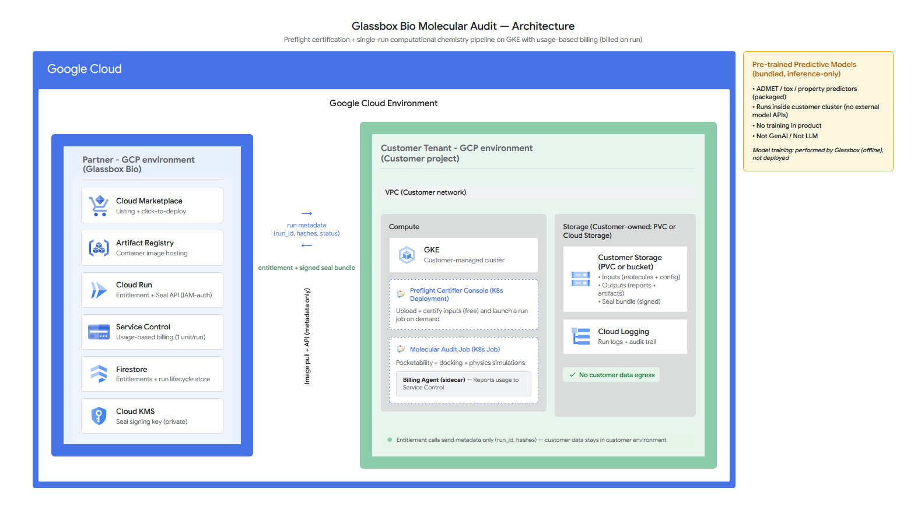
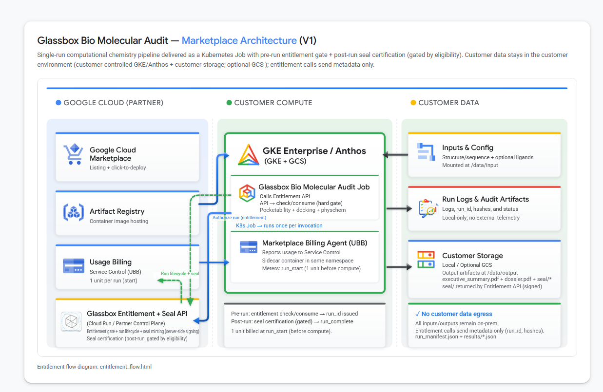

<p align="center">
  
  <br/>
  <span>Glassbox Bio Target Diligence Core 
  <br/>
    Google Cloud Marketplace Deployment Bundle (Helm chart + schema + examples)</span>
</p>


## Scope of this Repository
This repository contains the public configuration, documentation, and examples
required to distribute the Glassbox Bio Target Diligence Core Kubernetes app on
Google Cloud Marketplace.

It does **not** contain:
- Proprietary audit logic or scoring models
- Computational analysis modules
- Internal datasets or knowledge graphs
- Customer-specific configuration


## Contents

- `manifest/` - Marketplace deployment bundle (Helm chart, schema, Application CR).
- `docs/` - User guide, operations guide, and verification notes.
- `examples/` - Sample values files and CLI commands.

## Quick start

### Marketplace (one-click)

Deploy directly from Google Cloud Marketplace:

https://console.cloud.google.com/marketplace/product/glassbox-bio/molecular-audit-core
The Marketplace UI handles image wiring and configuration values.

### CLI (helm)

We officially support three opinionated deployment profiles. Choose one:

| Profile               | Expected runtime range | Rough cost range | Required cluster resources                      | When to use it                                                      |
| --------------------- | ---------------------- | ---------------- | ----------------------------------------------- | ------------------------------------------------------------------- |
| Starter (CPU)         | 1–4h (cap 4h)          | $$               | 1–2 vCPU, 4–8Gi RAM, 20Gi PVC                   | Fast validation runs, smallest datasets, cost-sensitive trials      |
| Standard (CPU)        | 2–6h (cap 6h)          | $$$              | 2–4 vCPU, 8–16Gi RAM, 50Gi PVC                  | Default choice for most audits; balanced speed vs cost              |
| Deep / GPU (optional) | 4–8h (cap 8h)          | $$$$             | 4–8 vCPU, 32–64Gi RAM, 1x NVIDIA GPU, 200Gi PVC | Deep evidence expansion, docking-heavy or GPU-accelerated workflows |

```bash
helm upgrade --install molecular-audit-core ./manifest/chart \
  --namespace molecular-audit-core --create-namespace \
  -f ./manifest/chart/values-standard.yaml \
  -f ./examples/values-gcs.yaml \
  --set storage.gcs.bucket=YOUR_BUCKET \
  --set workloadIdentity.gcpServiceAccount=your-sa@project.iam.gserviceaccount.com \
  --set image.repository=us-central1-docker.pkg.dev/glassbox-marketplace-prod/glassbox-bio-molecular-audit/molecular-audit-core \
  --set image.tag=1.0.0 \
  --set console.image.repository=us-central1-docker.pkg.dev/glassbox-marketplace-prod/glassbox-bio-molecular-audit/molecular-audit-core/console \
  --set console.image.tag=1.0.0 \
  --set config.projectId=YOUR_PROJECT_ID
```

For the full runbook and verification flow, see `docs/RUNBOOK_CUSTOMER.md`.

## Marketplace Architecture (V1)



## System Architecture (Detailed)




## Security Model

- Images are pulled from Google Artifact Registry.
- Customer data remains within the customer's GCP project.
- No audit data is transmitted outside the configured environment.
- Optional Workload Identity integration supported.


---

## Glassbox Bio Target Diligence Core
Deployment bundle provided here contains configuration and public artifacts only.

For full product information, methodology, and security documentation:

👉 https://www.glassbox-bio.com


